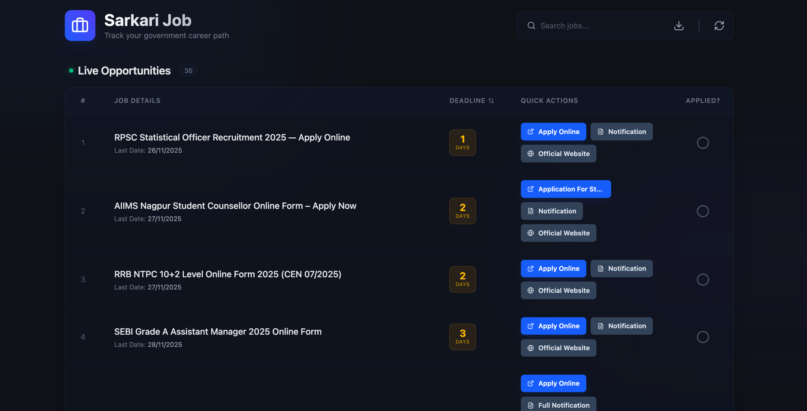
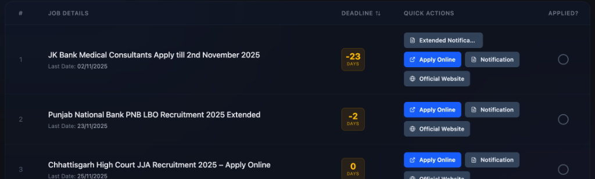

# Sarkari Job Portal

A modern, real-time government job tracking dashboard built with React. This application scrapes live job listings, helps you track deadlines, and manage your applications in a sleek, dark-themed interface.



## ✨ Features

- **🚀 Live Job Updates**: Real-time scraping of the latest government job vacancies.
- **📅 Smart Deadlines**: 
    - Automatically calculates days left.
    - Handles **Extended Dates** intelligently.
    - Auto-hides expired jobs to keep your list fresh.
    - Visual indicators for "Closing Soon" jobs.
- **📝 Application Tracking**: Mark jobs as "Applied" to move them to your personal history tab.
- **🔍 Powerful Search & Sort**: 
    - Instant search by job name or date.
    - Sort by Deadline (default) or Job Name.
- **⚡ Quick Actions**: Direct links to:
    - Apply Online
    - Official Notifications
    - Official Websites
- **📊 Data Export**: Export your job list to CSV for offline analysis.
- **🎨 Modern UI**: Fully responsive, dark mode design with glassmorphism effects.

## 📸 Screenshots

### Live Opportunities List


## 🛠️ Tech Stack

- **Frontend**: React.js (Vite)
- **Styling**: Tailwind CSS
- **Icons**: Lucide React
- **Data Fetching**: Custom scraping logic with proxy support

## 🚀 Getting Started

1.  **Clone the repository**
    ```bash
    git clone <repository-url>
    ```

2.  **Install dependencies**
    ```bash
    npm install
    ```

3.  **Run the development server**
    ```bash
    npm run dev
    ```

## 📄 License

**Non-Commercial & Educational Use Only**

This project is intended for educational purposes to demonstrate web scraping and React development. You may not use this for commercial purposes or sell it. See the [LICENSE](LICENSE) file for details.

---
*Disclaimer: This application scrapes data from third-party sources for demonstration purposes. The developers do not claim ownership of the scraped data.*
